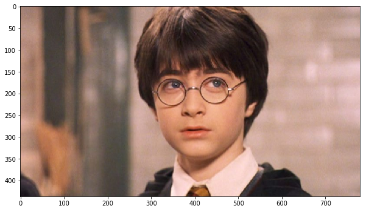
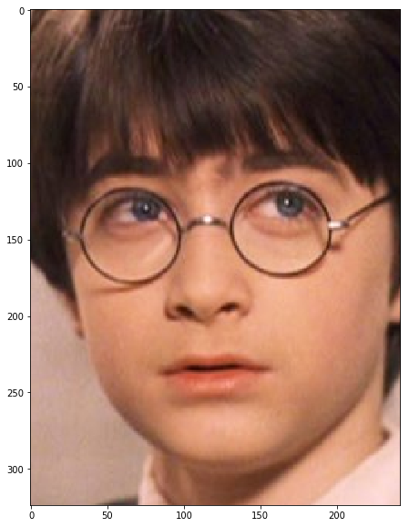
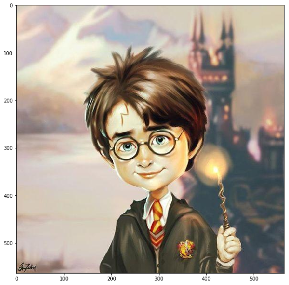
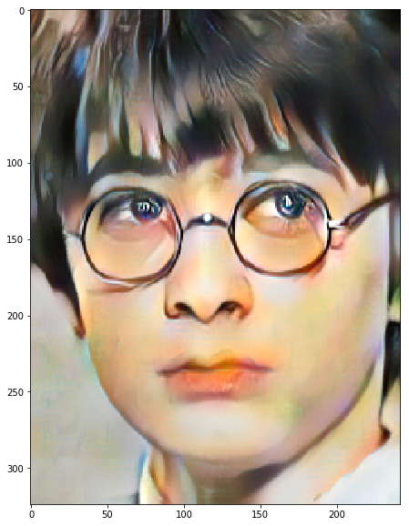

# Your Cartoon Face
这是一个基于paddlehub的项目。（疯狂安利aistudio，Tesla V100警告

本项目的功能是：输入一个人的照片，输出这个人的漫画风格脸。

本项目分为两部分，第一部分，检测出图片中的人脸，并进行裁剪。第二部分，将检测出的人脸变成漫画风格的人脸。

```python
!pip install paddlehub==1.6.0 -i https://pypi.tuna.tsinghua.edu.cn/simple
```

```
Looking in indexes: https://pypi.tuna.tsinghua.edu.cn/simple
Requirement already satisfied: paddlehub==1.6.0 in /opt/conda/envs/python35-paddle120-env/lib/python3.7/site-packages (1.6.0)
Requirement already satisfied: yapf==0.26.0 in /opt/conda/envs/python35-paddle120-env/lib/python3.7/site-packages (from paddlehub==1.6.0) (0.26.0)
Requirement already satisfied: flask>=1.1.0 in /opt/conda/envs/python35-paddle120-env/lib/python3.7/site-packages (from paddlehub==1.6.0) (1.1.1)
Requirement already satisfied: colorlog in /opt/conda/envs/python35-paddle120-env/lib/python3.7/site-packages (from paddlehub==1.6.0) (4.1.0)
Requirement already satisfied: pyyaml in /opt/conda/envs/python35-paddle120-env/lib/python3.7/site-packages (from paddlehub==1.6.0) (5.1.2)
Requirement already satisfied: tb-paddle in /opt/conda/envs/python35-paddle120-env/lib/python3.7/site-packages (from paddlehub==1.6.0) (0.3.6)
Requirement already satisfied: numpy; python_version >= "3" in /opt/conda/envs/python35-paddle120-env/lib/python3.7/site-packages (from paddlehub==1.6.0) (1.16.4)
Requirement already satisfied: sentencepiece in /opt/conda/envs/python35-paddle120-env/lib/python3.7/site-packages (from paddlehub==1.6.0) (0.1.85)
Requirement already satisfied: tensorboard>=1.15 in /opt/conda/envs/python35-paddle120-env/lib/python3.7/site-packages (from paddlehub==1.6.0) (2.1.0)
Requirement already satisfied: pre-commit in /opt/conda/envs/python35-paddle120-env/lib/python3.7/site-packages (from paddlehub==1.6.0) (1.21.0)
Requirement already satisfied: gunicorn>=19.10.0; sys_platform != "win32" in /opt/conda/envs/python35-paddle120-env/lib/python3.7/site-packages (from paddlehub==1.6.0) (20.0.4)
Requirement already satisfied: nltk in /opt/conda/envs/python35-paddle120-env/lib/python3.7/site-packages (from paddlehub==1.6.0) (3.4.5)
Requirement already satisfied: Pillow in /opt/conda/envs/python35-paddle120-env/lib/python3.7/site-packages (from paddlehub==1.6.0) (6.2.0)
Requirement already satisfied: opencv-python in /opt/conda/envs/python35-paddle120-env/lib/python3.7/site-packages (from paddlehub==1.6.0) (4.1.1.26)
Requirement already satisfied: cma==2.7.0 in /opt/conda/envs/python35-paddle120-env/lib/python3.7/site-packages (from paddlehub==1.6.0) (2.7.0)
Requirement already satisfied: flake8 in /opt/conda/envs/python35-paddle120-env/lib/python3.7/site-packages (from paddlehub==1.6.0) (3.7.9)
Requirement already satisfied: requests in /opt/conda/envs/python35-paddle120-env/lib/python3.7/site-packages (from paddlehub==1.6.0) (2.22.0)
Requirement already satisfied: chardet==3.0.4 in /opt/conda/envs/python35-paddle120-env/lib/python3.7/site-packages (from paddlehub==1.6.0) (3.0.4)
Requirement already satisfied: six>=1.10.0 in /opt/conda/envs/python35-paddle120-env/lib/python3.7/site-packages (from paddlehub==1.6.0) (1.12.0)
Requirement already satisfied: pandas; python_version >= "3" in /opt/conda/envs/python35-paddle120-env/lib/python3.7/site-packages (from paddlehub==1.6.0) (0.23.4)
Requirement already satisfied: protobuf>=3.6.0 in /opt/conda/envs/python35-paddle120-env/lib/python3.7/site-packages (from paddlehub==1.6.0) (3.10.0)
Requirement already satisfied: click>=5.1 in /opt/conda/envs/python35-paddle120-env/lib/python3.7/site-packages (from flask>=1.1.0->paddlehub==1.6.0) (7.0)
Requirement already satisfied: itsdangerous>=0.24 in /opt/conda/envs/python35-paddle120-env/lib/python3.7/site-packages (from flask>=1.1.0->paddlehub==1.6.0) (1.1.0)
Requirement already satisfied: Werkzeug>=0.15 in /opt/conda/envs/python35-paddle120-env/lib/python3.7/site-packages (from flask>=1.1.0->paddlehub==1.6.0) (0.16.0)
Requirement already satisfied: Jinja2>=2.10.1 in /opt/conda/envs/python35-paddle120-env/lib/python3.7/site-packages (from flask>=1.1.0->paddlehub==1.6.0) (2.10.3)
Requirement already satisfied: moviepy in /opt/conda/envs/python35-paddle120-env/lib/python3.7/site-packages (from tb-paddle->paddlehub==1.6.0) (1.0.1)
Requirement already satisfied: wheel>=0.26; python_version >= "3" in /opt/conda/envs/python35-paddle120-env/lib/python3.7/site-packages (from tensorboard>=1.15->paddlehub==1.6.0) (0.33.6)
Requirement already satisfied: grpcio>=1.24.3 in /opt/conda/envs/python35-paddle120-env/lib/python3.7/site-packages (from tensorboard>=1.15->paddlehub==1.6.0) (1.26.0)
Requirement already satisfied: google-auth<2,>=1.6.3 in /opt/conda/envs/python35-paddle120-env/lib/python3.7/site-packages (from tensorboard>=1.15->paddlehub==1.6.0) (1.10.0)
Requirement already satisfied: absl-py>=0.4 in /opt/conda/envs/python35-paddle120-env/lib/python3.7/site-packages (from tensorboard>=1.15->paddlehub==1.6.0) (0.8.1)
Requirement already satisfied: markdown>=2.6.8 in /opt/conda/envs/python35-paddle120-env/lib/python3.7/site-packages (from tensorboard>=1.15->paddlehub==1.6.0) (3.1.1)
Requirement already satisfied: google-auth-oauthlib<0.5,>=0.4.1 in /opt/conda/envs/python35-paddle120-env/lib/python3.7/site-packages (from tensorboard>=1.15->paddlehub==1.6.0) (0.4.1)
Requirement already satisfied: setuptools>=41.0.0 in /opt/conda/envs/python35-paddle120-env/lib/python3.7/site-packages (from tensorboard>=1.15->paddlehub==1.6.0) (41.4.0)
Requirement already satisfied: cfgv>=2.0.0 in /opt/conda/envs/python35-paddle120-env/lib/python3.7/site-packages (from pre-commit->paddlehub==1.6.0) (2.0.1)
Requirement already satisfied: virtualenv>=15.2 in /opt/conda/envs/python35-paddle120-env/lib/python3.7/site-packages (from pre-commit->paddlehub==1.6.0) (16.7.9)
Requirement already satisfied: aspy.yaml in /opt/conda/envs/python35-paddle120-env/lib/python3.7/site-packages (from pre-commit->paddlehub==1.6.0) (1.3.0)
Requirement already satisfied: toml in /opt/conda/envs/python35-paddle120-env/lib/python3.7/site-packages (from pre-commit->paddlehub==1.6.0) (0.10.0)
Requirement already satisfied: importlib-metadata; python_version < "3.8" in /opt/conda/envs/python35-paddle120-env/lib/python3.7/site-packages (from pre-commit->paddlehub==1.6.0) (0.23)
Requirement already satisfied: nodeenv>=0.11.1 in /opt/conda/envs/python35-paddle120-env/lib/python3.7/site-packages (from pre-commit->paddlehub==1.6.0) (1.3.4)
Requirement already satisfied: identify>=1.0.0 in /opt/conda/envs/python35-paddle120-env/lib/python3.7/site-packages (from pre-commit->paddlehub==1.6.0) (1.4.10)
Requirement already satisfied: pycodestyle<2.6.0,>=2.5.0 in /opt/conda/envs/python35-paddle120-env/lib/python3.7/site-packages (from flake8->paddlehub==1.6.0) (2.5.0)
Requirement already satisfied: entrypoints<0.4.0,>=0.3.0 in /opt/conda/envs/python35-paddle120-env/lib/python3.7/site-packages (from flake8->paddlehub==1.6.0) (0.3)
Requirement already satisfied: pyflakes<2.2.0,>=2.1.0 in /opt/conda/envs/python35-paddle120-env/lib/python3.7/site-packages (from flake8->paddlehub==1.6.0) (2.1.1)
Requirement already satisfied: mccabe<0.7.0,>=0.6.0 in /opt/conda/envs/python35-paddle120-env/lib/python3.7/site-packages (from flake8->paddlehub==1.6.0) (0.6.1)
Requirement already satisfied: certifi>=2017.4.17 in /opt/conda/envs/python35-paddle120-env/lib/python3.7/site-packages (from requests->paddlehub==1.6.0) (2019.9.11)
Requirement already satisfied: urllib3!=1.25.0,!=1.25.1,<1.26,>=1.21.1 in /opt/conda/envs/python35-paddle120-env/lib/python3.7/site-packages (from requests->paddlehub==1.6.0) (1.25.6)
Requirement already satisfied: idna<2.9,>=2.5 in /opt/conda/envs/python35-paddle120-env/lib/python3.7/site-packages (from requests->paddlehub==1.6.0) (2.8)
Requirement already satisfied: pytz>=2011k in /opt/conda/envs/python35-paddle120-env/lib/python3.7/site-packages (from pandas; python_version >= "3"->paddlehub==1.6.0) (2019.3)
Requirement already satisfied: python-dateutil>=2.5.0 in /opt/conda/envs/python35-paddle120-env/lib/python3.7/site-packages (from pandas; python_version >= "3"->paddlehub==1.6.0) (2.8.0)
Requirement already satisfied: MarkupSafe>=0.23 in /opt/conda/envs/python35-paddle120-env/lib/python3.7/site-packages (from Jinja2>=2.10.1->flask>=1.1.0->paddlehub==1.6.0) (1.1.1)
Requirement already satisfied: tqdm<5.0,>=4.11.2 in /opt/conda/envs/python35-paddle120-env/lib/python3.7/site-packages (from moviepy->tb-paddle->paddlehub==1.6.0) (4.36.1)
Requirement already satisfied: decorator<5.0,>=4.0.2 in /opt/conda/envs/python35-paddle120-env/lib/python3.7/site-packages (from moviepy->tb-paddle->paddlehub==1.6.0) (4.4.0)
Requirement already satisfied: imageio-ffmpeg>=0.2.0; python_version >= "3.4" in /opt/conda/envs/python35-paddle120-env/lib/python3.7/site-packages (from moviepy->tb-paddle->paddlehub==1.6.0) (0.3.0)
Requirement already satisfied: imageio<3.0,>=2.5; python_version >= "3.4" in /opt/conda/envs/python35-paddle120-env/lib/python3.7/site-packages (from moviepy->tb-paddle->paddlehub==1.6.0) (2.6.1)
Requirement already satisfied: proglog<=1.0.0 in /opt/conda/envs/python35-paddle120-env/lib/python3.7/site-packages (from moviepy->tb-paddle->paddlehub==1.6.0) (0.1.9)
Requirement already satisfied: cachetools<5.0,>=2.0.0 in /opt/conda/envs/python35-paddle120-env/lib/python3.7/site-packages (from google-auth<2,>=1.6.3->tensorboard>=1.15->paddlehub==1.6.0) (4.0.0)
Requirement already satisfied: rsa<4.1,>=3.1.4 in /opt/conda/envs/python35-paddle120-env/lib/python3.7/site-packages (from google-auth<2,>=1.6.3->tensorboard>=1.15->paddlehub==1.6.0) (4.0)
Requirement already satisfied: pyasn1-modules>=0.2.1 in /opt/conda/envs/python35-paddle120-env/lib/python3.7/site-packages (from google-auth<2,>=1.6.3->tensorboard>=1.15->paddlehub==1.6.0) (0.2.7)
Requirement already satisfied: requests-oauthlib>=0.7.0 in /opt/conda/envs/python35-paddle120-env/lib/python3.7/site-packages (from google-auth-oauthlib<0.5,>=0.4.1->tensorboard>=1.15->paddlehub==1.6.0) (1.3.0)
Requirement already satisfied: zipp>=0.5 in /opt/conda/envs/python35-paddle120-env/lib/python3.7/site-packages (from importlib-metadata; python_version < "3.8"->pre-commit->paddlehub==1.6.0) (0.6.0)
Requirement already satisfied: pyasn1>=0.1.3 in /opt/conda/envs/python35-paddle120-env/lib/python3.7/site-packages (from rsa<4.1,>=3.1.4->google-auth<2,>=1.6.3->tensorboard>=1.15->paddlehub==1.6.0) (0.4.8)
Requirement already satisfied: oauthlib>=3.0.0 in /opt/conda/envs/python35-paddle120-env/lib/python3.7/site-packages (from requests-oauthlib>=0.7.0->google-auth-oauthlib<0.5,>=0.4.1->tensorboard>=1.15->paddlehub==1.6.0) (3.1.0)
Requirement already satisfied: more-itertools in /opt/conda/envs/python35-paddle120-env/lib/python3.7/site-packages (from zipp>=0.5->importlib-metadata; python_version < "3.8"->pre-commit->paddlehub==1.6.0) (7.2.0)
```

## Part 1. 人脸检测

```python
import matplotlib.pyplot as plt
import cv2
import numpy as np
import paddlehub as hub
```

**先看一看输入图片**

```python
img_path = ['./data/hp.jpg']
img = cv2.imread(img_path[0])
img = cv2.cvtColor(img, cv2.COLOR_RGB2BGR)
plt.figure(figsize=(10, 10))
plt.imshow(img)
plt.show()
```



**加载face dectector预训练模型**

```python
face_detect_module = hub.Module(name='ultra_light_fast_generic_face_detector_1mb_640')
input_dict = {'image': img_path}
results = face_detect_module.face_detection(data=input_dict)
print(results[0])
data = results[0]['data'][0]
top = max(int(data['top']-20), 0)
bottom = min(int(data['bottom']+20), img.shape[0])
left = max(int(data['left']-20), 0)
right = min(int(data['right']+20), img.shape[1])
img = img[top:bottom, left:right]
plt.figure(figsize=(10, 10))
plt.imshow(img)
plt.show()
img = cv2.cvtColor(img, cv2.COLOR_BGR2RGB)
cv2.imwrite('./data/hp2.jpg', img)
```

```
[2020-04-18 14:12:24,471] [    INFO] - Installing ultra_light_fast_generic_face_detector_1mb_640 module
[2020-04-18 14:12:24,474] [    INFO] - Module ultra_light_fast_generic_face_detector_1mb_640 already installed in /home/aistudio/.paddlehub/modules/ultra_light_fast_generic_face_detector_1mb_640
```

```
{'data': [{'left': 302.328369140625, 'right': 504.18096923828125, 'top': 70.77826690673828, 'bottom': 354.7093200683594, 'confidence': 0.9999996423721313}], 'path': './data/hp.jpg'}
```



## Part 2. Style Transfer

(由于用的普通的预训练gan，transfer效果一般般，留下了菜鸡的眼泪)

**看一看风格图片**

```python
style_img = cv2.cvtColor(cv2.imread('data/C00003.jpg'), cv2.COLOR_RGB2BGR)
plt.figure(figsize=(10, 10))
plt.imshow(style_img)
plt.show()

```



**加载style transfer模型**

```python
stylepro_artistic = hub.Module(name="stylepro_artistic")
result = stylepro_artistic.style_transfer(
    images=[{
        'content': cv2.cvtColor(cv2.imread('data/hp2.jpg'), cv2.COLOR_RGB2BGR),
        'styles': [cv2.cvtColor(cv2.imread('data/C00003.jpg'), cv2.COLOR_RGB2BGR)]
    }])
cartoon_img = result[0]['data']
plt.figure(figsize=(10, 10))
plt.imshow(cartoon_img)
plt.show()

```

```
[2020-04-18 14:13:48,868] [    INFO] - Installing stylepro_artistic module
[2020-04-18 14:13:48,871] [    INFO] - Module stylepro_artistic already installed in /home/aistudio/.paddlehub/modules/stylepro_artistic

```


